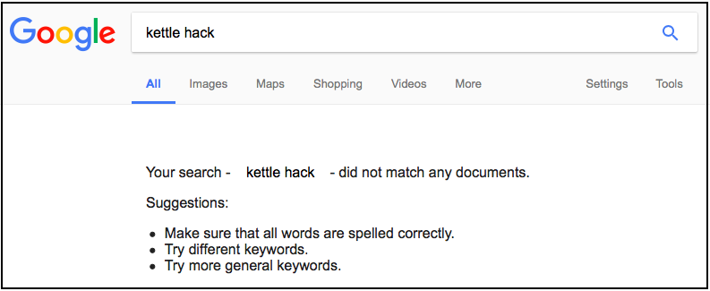
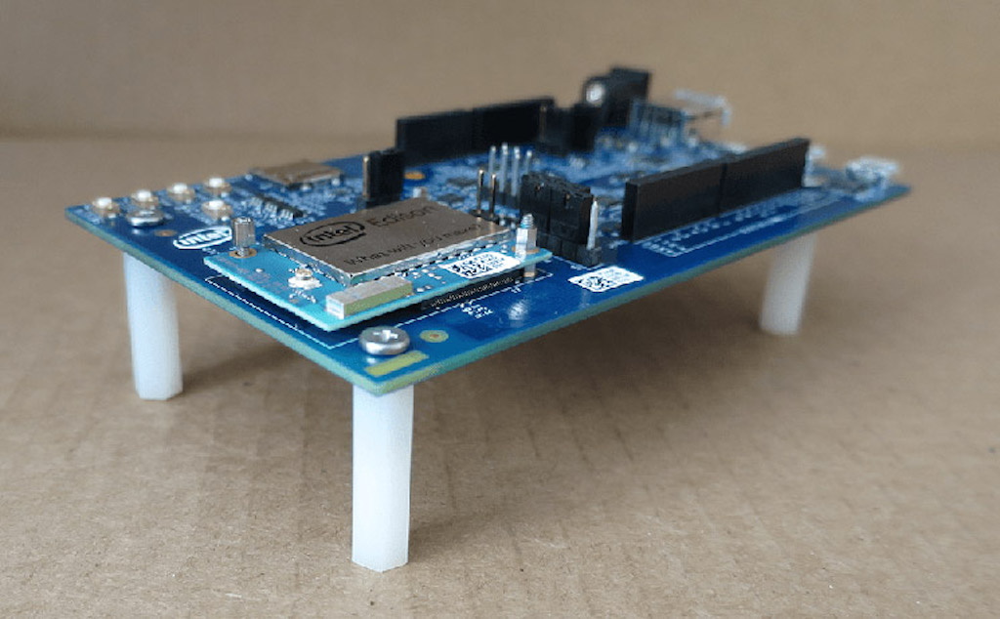
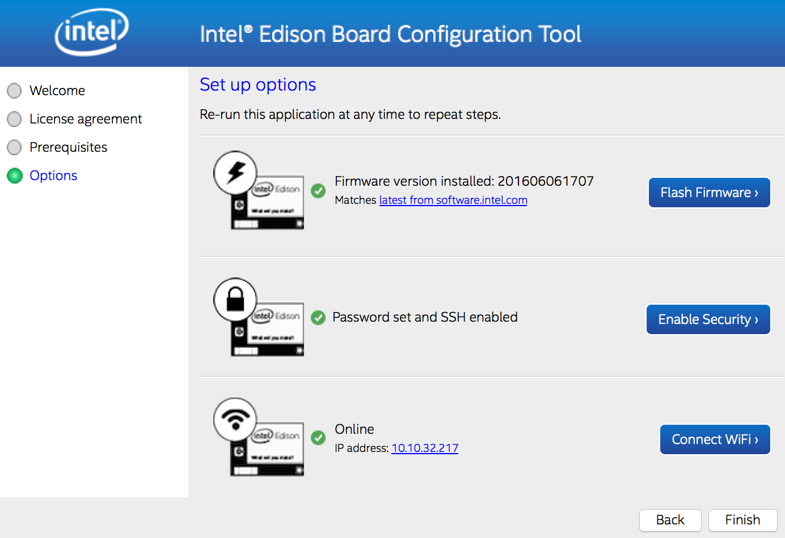

These docs are a **work in progress**, come back soon for more *swag*!

---

# Teabot

### By Team _Brand New Kettle-hack_

*A fun weekend project by Emelie Hofland and Jaime González-Arintero. Created during the [Intel IoT Solutions Hackathon in Fürth](https://software.intel.com/en-us/blogs/2017/02/03/intel-iot-solutions-hackathon), on March 11 - 12, 2017.*

Pictures and additional media of the **project presentation at the hackathon** can be found in [this folder](./hackathon).

If you are wondering _why the hack_ would someone use **such name for a team**, you may find the answer [here](https://www.youtube.com/watch?v=SYVLxLvdhpY). 

## Introduction

After **months** of extensive market research, we discovered that **no-one ever** hacked a kettle before.



Okay, this may not be _fully_ true. There are _a few_ Internet-connected kettles out there. But hey, never enough!

Anyway... in this repository we explain **how to hack a kettle, so it can be turned on and off using voice commands** (via the [Amazon Alexa](https://developer.amazon.com/alexa) service), **or "chatting" with a bot** (via [Slack](https://slack.com)). It's divided into different parts or modules, and not them all are required to make it work, so in the future they can be integrated in other projects.

## Disclaimer: Working with Electrical Equipment

Your safety is your own responsibility, including proper use of equipment and safety gear, and determining whether you have adequate skill and experience. Power tools, electricity, and other resources that may be used in this project are dangerous, unless used properly and with adequate precautions, including safety gear. Before proceeding, first read the basic [at-home electrical safety tips](https://www.bchydro.com/safety-outages/electrical-safety/safety-at-home/electrical-safety-tips.html).

This project involves working with mains voltage, and the modification of a home appliance. **Only a qualified person may perform wirings of electrical equipment. Improper operations may place the user at serious risk.**

## Requirements

The following hardware is required:

* Electric jug kettle. For this project we used an affordable model from the brand Tristar, like [this one](http://www.tristar.eu/en/Home_Appliances/Breakfast___Brunch/Jug_Kettles/WK-1337/3/6669).
* [Intel® Edison Arduino Breakout Kit](https://www.arduino.cc/en/ArduinoCertified/IntelEdison#toc3)
* 3-5V / 230V relay module (like [this Grove one](https://www.seeedstudio.com/Grove-Relay-p-769.html)). For this project we used the [relay shield for the WeMos D1 mini](https://www.aliexpress.com/store/product/Relay-Shield-for-WeMos-D1-mini-button/1331105_32596395175.html?spm=2114.12010608.0.0.JXGY1P).
* An [Amazon Echo](http://a.co/9imYj0b) (or an [Echo Dot](http://a.co/4MYRdzt))
* Assorted jumper wires.
* Cable cutter.
* Small flathead screwdriver.

A computer is required to connect the Edison board for flashing and configuration.

## Intel® Edison Setup

### Hardware Assembly

First of all, assemble the Arduino Expansion Board according to the directions in the [Intel® Edison guide](https://software.intel.com/en-us/node/628221), and make sure that your board looks like this:



### Initial Configuration

Once done, configure your Edison board using the official **Setup Tool (*aka.* Intel® Edison Board Configuration Tool)**. Simply follow the online instructions according to your operating system:  

* Windows: [64-bit](https://software.intel.com/en-us/get-started-edison-windows-step2) | [32-bit](https://software.intel.com/en-us/get-started-edison-windows-32-step2)
* [Mac OS X](https://software.intel.com/en-us/get-started-edison-osx-step2)
* [Linux](https://software.intel.com/en-us/get-started-edison-linux-step2)

Once done, the Setup Tool should look like the screenshot below. **Copy the IP address of the board** shown at the bottom of the tool, since it will be required for the next step.




### SSH'ing into the Board

When done with firmware flashing and the basic configurations of the board, we can SSH into it and do further configurations by using its Linux shell. As said before, the Edison's IP address is found in the WiFi section of the **Intel® Edison Board Configuration Tool** (or Setup Tool).

Open the terminal, and run the following command:  
`$ ssh root@<EDISON-IP-ADDRESS>`

If you're using Windows, [PuTTY](http://www.putty.org) will probably be your best option. You may find a [good tutorial here](https://mediatemple.net/community/products/dv/204404604/using-ssh-in-putty-).

When prompted for a password use the one that was set in the security settings of the Intel Edison Board Configuration Tool. If everything worked properly, we should now be logged in to the board as **root**.

Before running the script that controls the relay (turning the kettle on and off), we'll have to install all the necessary libraries and Python dependencies.

### Clone the Repository

Once you are logged in the Intel Edison and are able to interact with its Linux shell, you can clone the git repository by executing the following command:

`$ git clone https://github.com/Emelieh21/brand-new-kettle-hack.git`

### Installing the Libmraa Library

The default firmware (Linux Yocto image) comes with Python 2.7 already installed, so you could start running scripts right away. However, if you wish to interact with the GPIOs of the Intel Edison breakout board, you'll have to install the [Libmraa](https://github.com/intel-iot-devkit/mraa) library. As mentioned in the linked repository, you can install it through the [OPKG package manager](https://wiki.openwrt.org/doc/techref/opkg) by executing the following three commands in the Linux shell of the Edison board:

```shell
$ echo 'src mraa-upm http://iotdk.intel.com/repos/3.5/intelgalactic/opkg/i586' > /etc/opkg/mraa-upm.conf
$ opkg update
$ opkg install mraa
```

The first line adds the source of the `libmraa` repository to the package manager source list, the second one updates the existing [opkg](https://en.wikipedia.org/wiki/Opkg) packages, and the last one
installs the `libmraa` package.

-----WIP----

## "Teabot" for Alexa / Echo

-----WIP----

## "Teabot" for Slack

-----WIP----

## License

Copyright (C) 2017 Emelie Hofland <emelie_hofland@hotmail.com>, Jaime González-Arintero <a.lie.called.life@gmail.com>

Permission is hereby granted, free of charge, to any person obtaining a copy of this software and associated documentation files (the "Software"), to deal in the Software without restriction, including without limitation the rights to use, copy, modify, merge, publish, distribute, sublicense, and/or sell
copies of the Software, and to permit persons to whom the Software is furnished to do so, subject to the following conditions:

The above copyright notice and this permission notice shall be included in all copies or substantial portions of the Software.

Except as contained in this notice, the name(s) of the above copyright holders shall not be used in advertising or otherwise to promote the sale, use or
other dealings in this Software without prior written authorization.

THE SOFTWARE IS PROVIDED "AS IS," WITHOUT WARRANTY OF ANY KIND, EXPRESS OR IMPLIED, INCLUDING BUT NOT LIMITED TO THE WARRANTIES OF MERCHANTABILITY,
FITNESS FOR A PARTICULAR PURPOSE AND NONINFRINGEMENT.  IN NO EVENT SHALL THE AUTHORS OR COPYRIGHT HOLDERS BE LIABLE FOR ANY CLAIM, DAMAGES OR OTHER
LIABILITY, WHETHER IN AN ACTION OF CONTRACT, TORT OR OTHERWISE, ARISING FROM, OUT OF OR IN CONNECTION WITH THE SOFTWARE OR THE USE OR OTHER DEALINGS IN THE
SOFTWARE.