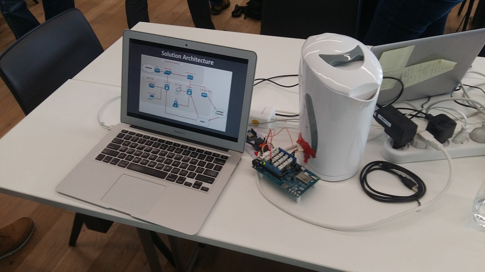
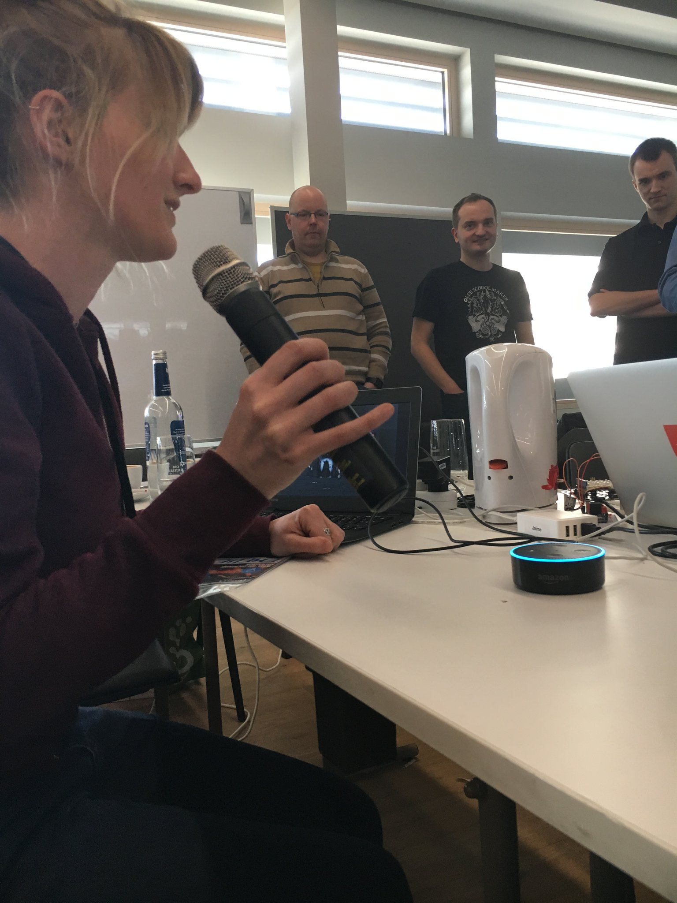
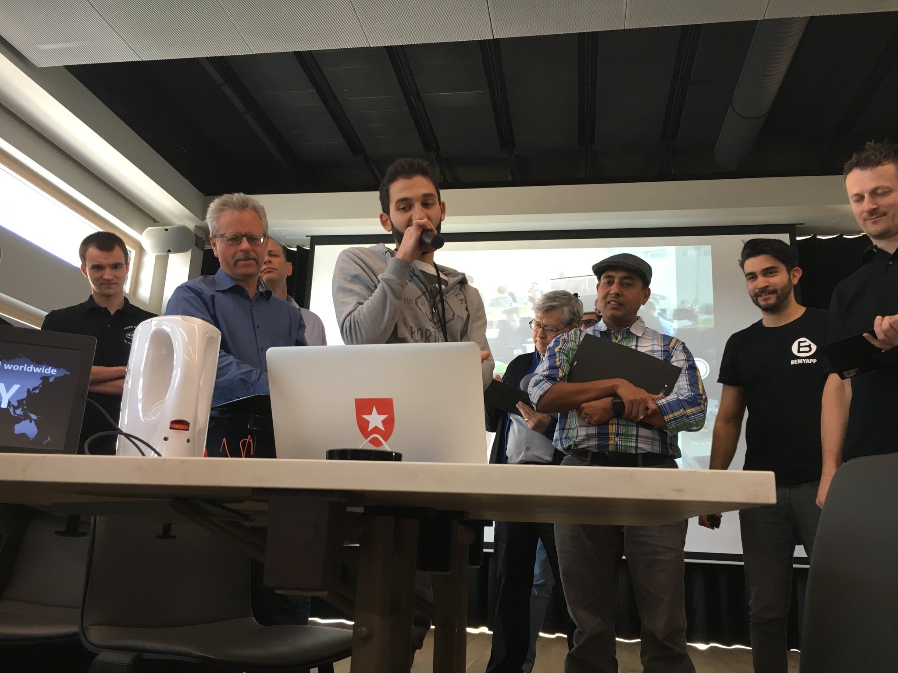
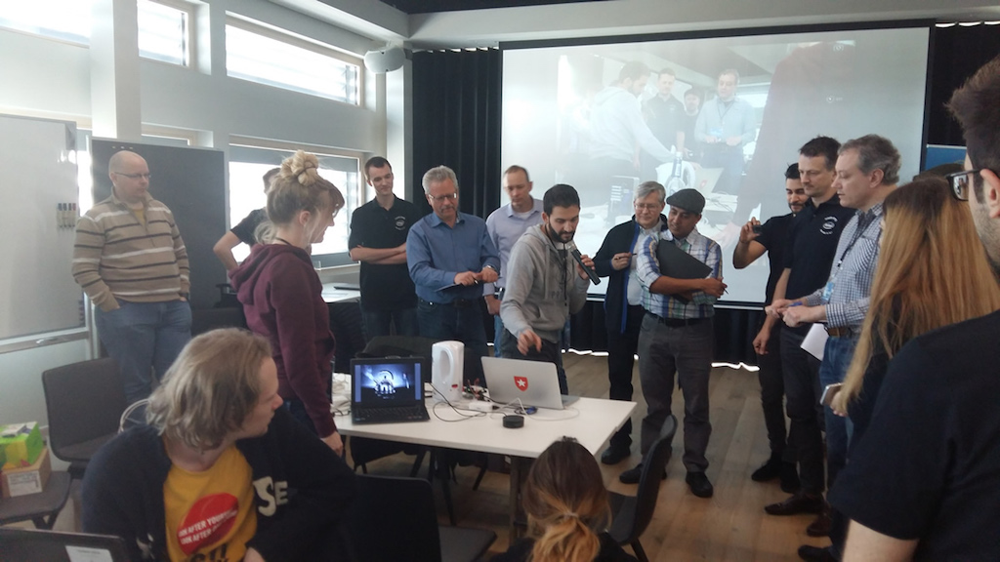

# Teabot
### By Team _Brand New Kettle-hack_

*A fun weekend project by Emelie Hofland and Jaime González-Arintero. Created during the [Intel IoT Solutions Hackathon in Fürth](https://iotevents.intel.com/Furth2017/), on March 11 - 12, 2017.*

## Introduction

After **months** of extensive market research, we discovered that **no-one ever** hacked a kettle before.

Okay, this may not be _fully_ true. There are _a few_ Internet-connected kettles out there. But hey, never enough!

These docs are a **work in progress**, come back soon for more *swag*.

Meanwhile, you can listen to the song that inspired us...

## Requirements

The following hardware is required:

* Electric jug kettle. For this project we used an affordable model from the brand Tristar, like [this one](http://www.tristar.eu/en/Home_Appliances/Breakfast___Brunch/Jug_Kettles/WK-1337/3/6669).
* [Intel® Edison Arduino Breakout Kit](https://www.arduino.cc/en/ArduinoCertified/IntelEdison#toc3)
* 3-5V / 230V relay module (like [this Grove one](https://www.seeedstudio.com/Grove-Relay-p-769.html)). For this project we used the [relay shield for the WeMos D1 mini](https://www.aliexpress.com/store/product/Relay-Shield-for-WeMos-D1-mini-button/1331105_32596395175.html?spm=2114.12010608.0.0.JXGY1P).
* Assorted jumper wires.
* Cable cutter.
* Small flathead screwdriver.

A computer is required to connect the Edison board for flashing and configuration.

## Disclaimer: Working with Electrical Equipment

Your safety is your own responsibility, including proper use of equipment and safety gear, and determining whether you have adequate skill and experience. Power tools, electricity, and other resources that may be used in this project are dangerous, unless used properly and with adequate precautions, including safety gear. Before proceeding, first read the basic [at-home electrical safety tips](https://www.bchydro.com/safety-outages/electrical-safety/safety-at-home/electrical-safety-tips.html).

This project involves working with mains voltage, and the modification of a home appliance. **Only a qualified person may perform wirings of electrical equipment. Improper operations may place the user at serious risk.**

## Intel Edison Setup

-----WIP----

## "Teabot" for Alexa / Echo

-----WIP----

## "Teabot" for Slack

-----WIP----

## Presenting the Project

Here we are presenting the project at the hackathon!

## License

Copyright (C) 2017 Emelie Hofland <emelie_hofland@hotmail.com>, Jaime González-Arintero <a.lie.called.life@gmail.com>

Permission is hereby granted, free of charge, to any person obtaining a copy of this software and associated documentation files (the "Software"), to deal in the Software without restriction, including without limitation the rights to use, copy, modify, merge, publish, distribute, sublicense, and/or sell
copies of the Software, and to permit persons to whom the Software is furnished to do so, subject to the following conditions:

The above copyright notice and this permission notice shall be included in all copies or substantial portions of the Software.

Except as contained in this notice, the name(s) of the above copyright holders shall not be used in advertising or otherwise to promote the sale, use or
other dealings in this Software without prior written authorization.

THE SOFTWARE IS PROVIDED "AS IS," WITHOUT WARRANTY OF ANY KIND, EXPRESS OR IMPLIED, INCLUDING BUT NOT LIMITED TO THE WARRANTIES OF MERCHANTABILITY,
FITNESS FOR A PARTICULAR PURPOSE AND NONINFRINGEMENT.  IN NO EVENT SHALL THE AUTHORS OR COPYRIGHT HOLDERS BE LIABLE FOR ANY CLAIM, DAMAGES OR OTHER
LIABILITY, WHETHER IN AN ACTION OF CONTRACT, TORT OR OTHERWISE, ARISING FROM, OUT OF OR IN CONNECTION WITH THE SOFTWARE OR THE USE OR OTHER DEALINGS IN THE
SOFTWARE.