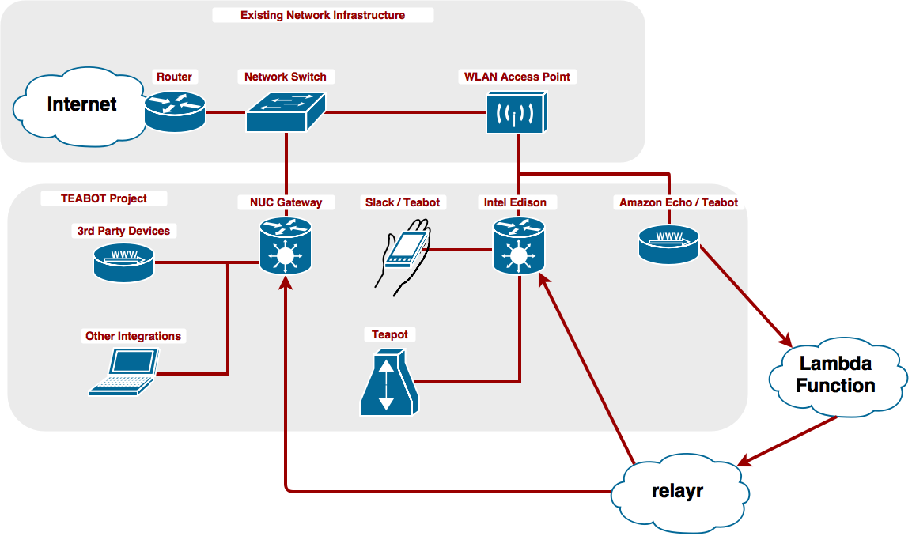
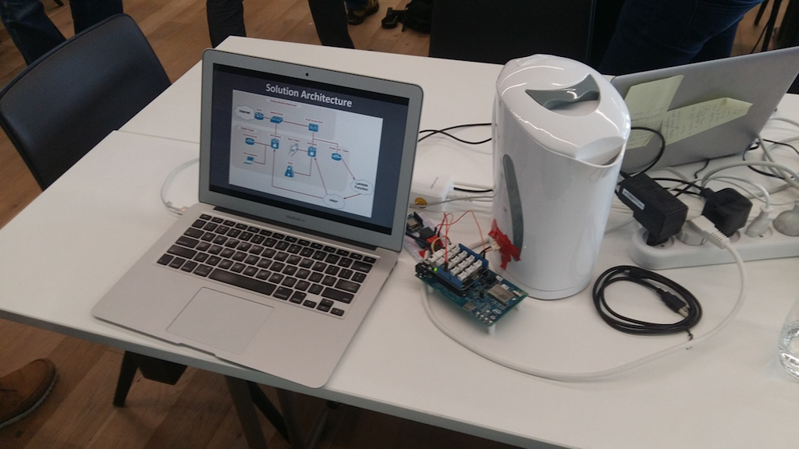
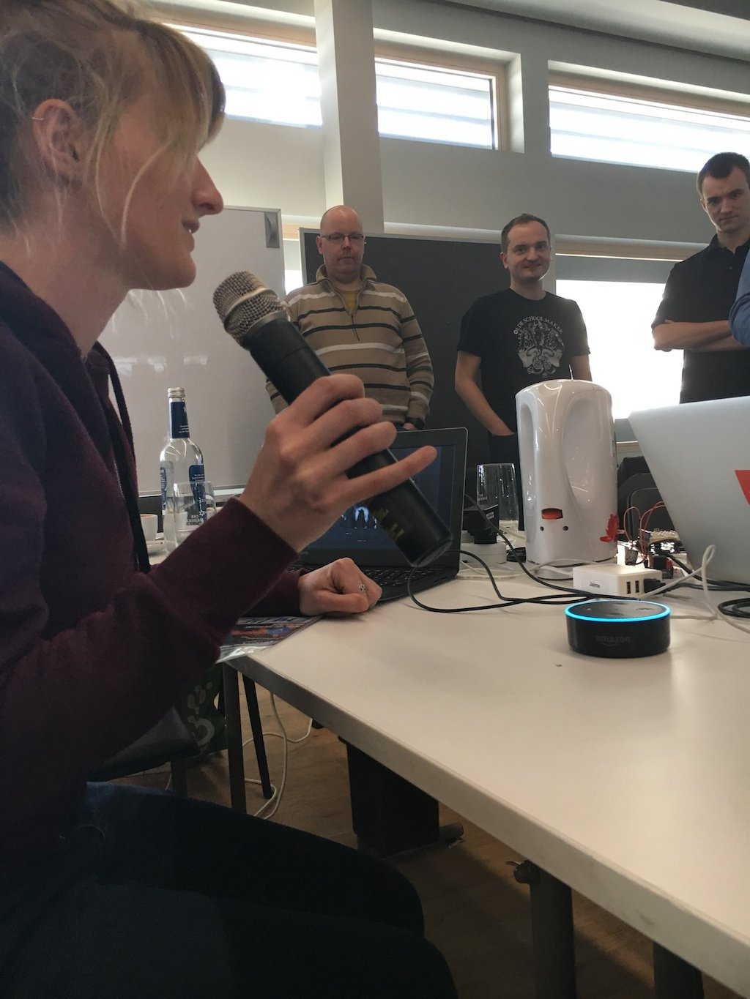
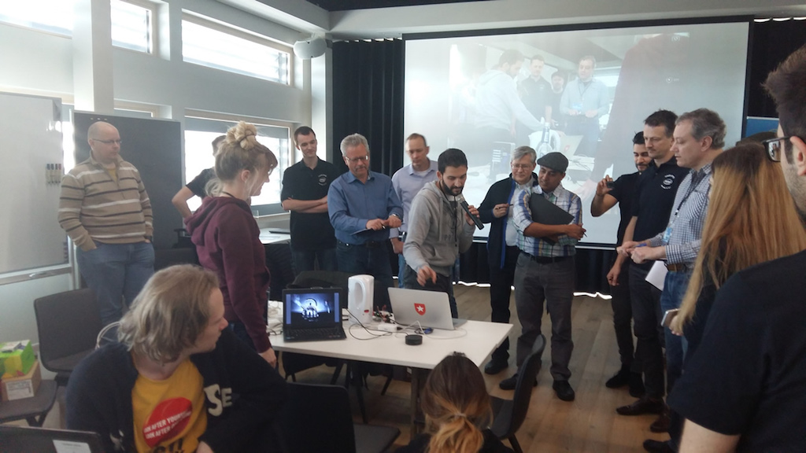
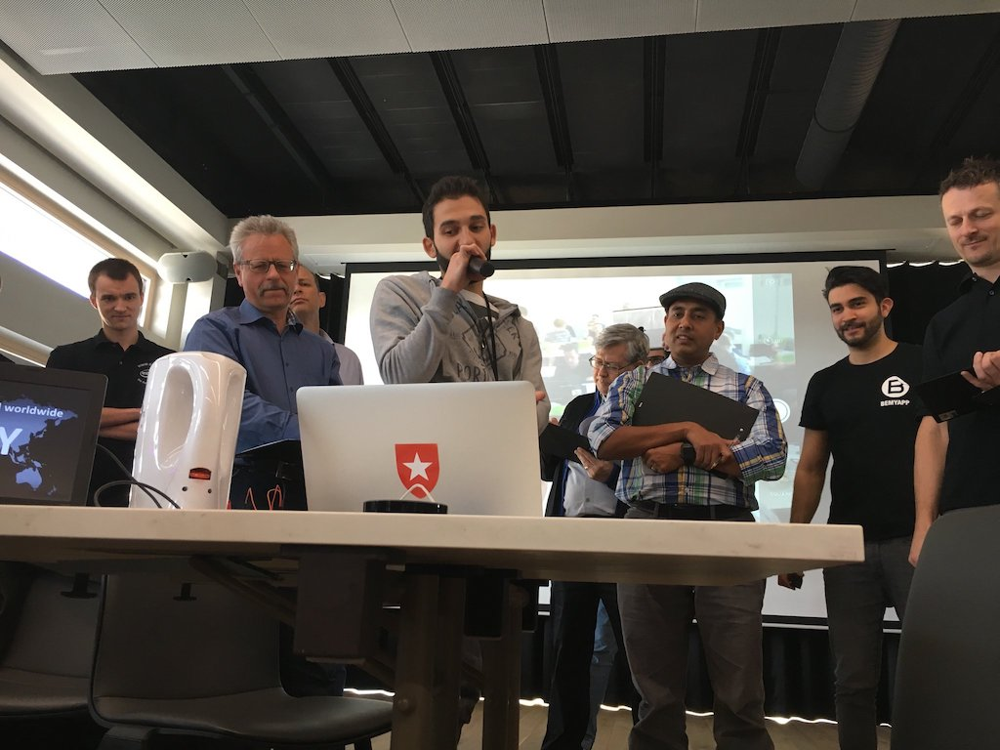

# Teabot
### By Team _Brand New Kettle-hack_

*A fun weekend project by Emelie Hofland and Jaime González-Arintero. Created during the [Intel IoT Solutions Hackathon in Fürth](https://iotevents.intel.com/Furth2017/), on March 11 - 12, 2017.*

## Hackathon Project Info

As said, this project was created during a hackathon, but some of the media and resources on this repository are not specifically required to replicate the setup.

For example, the solution used at the hackathon involved some additional building blocks, like an [Intel® NUC Kit DE3815TYKHE gateway](http://www.intel.com/content/www/us/en/nuc/nuc-kit-de3815tykhe-board-de3815tybe.html). Thus, the architecture diagram shown here is slightly different. Aside from that, some pictures of the presentation have been added below. Good memories! :)

## Solution Architecture

## Presenting the Project

Here we are presenting the project to the jury at the hackathon!

## License

Copyright (C) 2017 Emelie Hofland <emelie_hofland@hotmail.com>, Jaime González-Arintero <a.lie.called.life@gmail.com>

Permission is hereby granted, free of charge, to any person obtaining a copy of this software and associated documentation files (the "Software"), to deal in the Software without restriction, including without limitation the rights to use, copy, modify, merge, publish, distribute, sublicense, and/or sell
copies of the Software, and to permit persons to whom the Software is furnished to do so, subject to the following conditions:

The above copyright notice and this permission notice shall be included in all copies or substantial portions of the Software.

Except as contained in this notice, the name(s) of the above copyright holders shall not be used in advertising or otherwise to promote the sale, use or
other dealings in this Software without prior written authorization.

THE SOFTWARE IS PROVIDED "AS IS," WITHOUT WARRANTY OF ANY KIND, EXPRESS OR IMPLIED, INCLUDING BUT NOT LIMITED TO THE WARRANTIES OF MERCHANTABILITY,
FITNESS FOR A PARTICULAR PURPOSE AND NONINFRINGEMENT.  IN NO EVENT SHALL THE AUTHORS OR COPYRIGHT HOLDERS BE LIABLE FOR ANY CLAIM, DAMAGES OR OTHER
LIABILITY, WHETHER IN AN ACTION OF CONTRACT, TORT OR OTHERWISE, ARISING FROM, OUT OF OR IN CONNECTION WITH THE SOFTWARE OR THE USE OR OTHER DEALINGS IN THE
SOFTWARE.