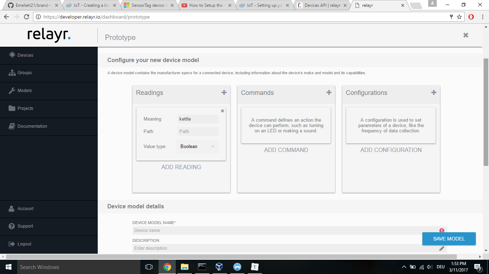
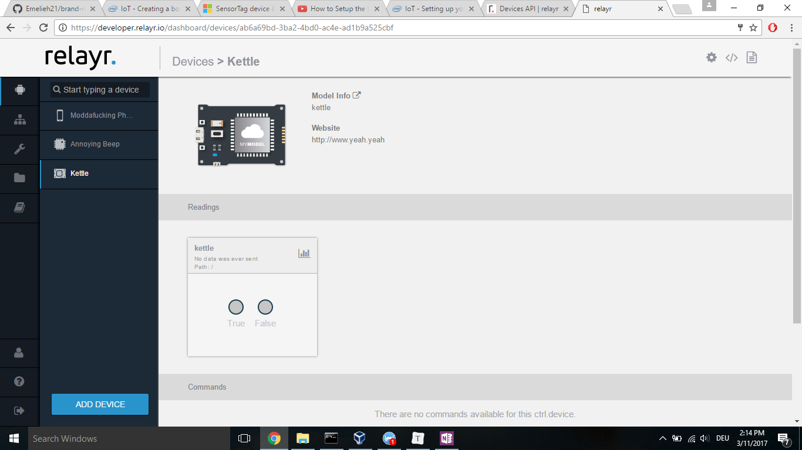

# Setting up a device in the relayr cloud

To make an interaction between Alexa/SlackBot and the kettle possible - we set up a device in the cloud to which both Alexa/SlackBot and the Edison Intel board can communicate. 

### Create a virtual "kettle" device on the Relayr cloud

We need to create a devide on the relayr cloud for Alexa/our SlackBot to send triggers to. This means: instead of a sensor sending data input to the relayr dashboard - the data input will come from Alexa/our SlackBot. 

##### Step 1: Create a custom model

Since it is not a real device - we set up a custom model. Login to your [relayr developer account](developer.relayr.io), go to the tab "models" on the left side. Click "add new model", click on the + sign in the "readings" box and enter the following:

We named our model _Kettle_ and set the meaning to _kettle_ as well, you can of course choose any name you like. For the Value type, choose **Boolean** (we will be sending True's and Falses). You will have to fill in a website as well for some reason - this can be a fake URL as well (www.yeah.yeah for example). When you're done click **save model**.

##### Step 2: Create a device

Once you saved your model, you can click on _create device_ and click _finish_ right away in the next step without changing anything. Give your device a name and now your device should be created.

If you click on the settings wheel in the upper right corner as you see here:

You can find the device ID and credentials of your device. For the following steps you will need:

* the **device ID**
* your **relayr token**: you can find this by going to _Account_ in relayr.

To test whether your virtual device is working - you can fill in your relayr token and device ID in the [python_http_post_request.py](brand-new-kettle-hack/python-scripts/python_http_post_request.py) file and run it:

`$ python python_http_post_request.py`

In the relayr dashboard - the value of _kettle_ should change to **True** when you run this.

### Optional: create a "kettle temperature" device on the Relayr cloud

If you also want to add an temperature sensor to your kettle, it is best to set up another device on your dashboard. In contrast to the "kettle" device we created above, this is a real device receive data input from the temperature sensor, not from Alexa/SlackBot. Repeat the above, only this time - instead of Boolean, pick **Number** as a Value Type. We named this device _kettle temperature_. From the "kettle temperature" device we will be doing HTTP get requests from Alexa/SlackBot.

