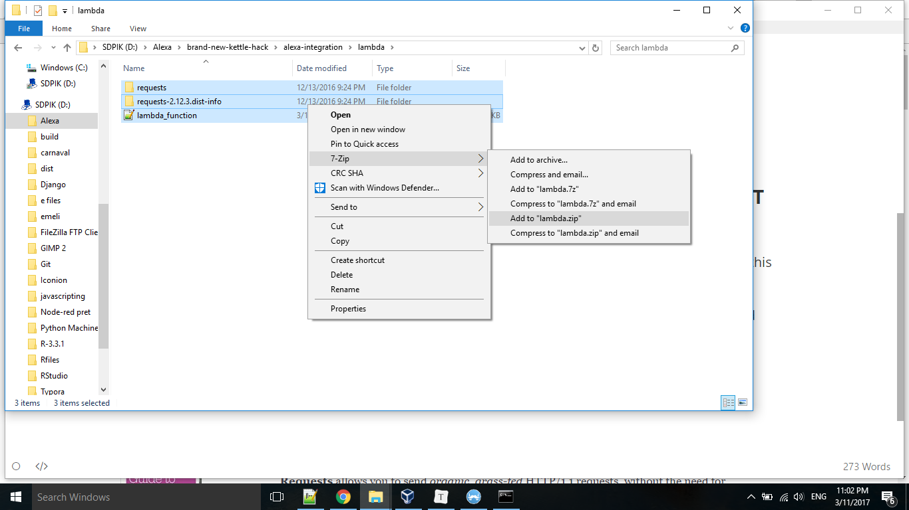

# Triggering the Kettle via Alexa

We want to be able to ask Alexa: _"Alexa, ask Teabot to start boiling"_ and subsequently the kettle should magically go on (we picked the name Teabot for our Alexa skill - of course you can name it any way you please).  Therefore, we need Alexa to send a trigger to the kettle each time we want it to start or stop boiling. For this we use [AWS lambda](https://aws.amazon.com/console/) and the [Alexa developer console](developer.amazon.com). 

For more information on getting started with creating Alexa Skills - see this [tutorial](https://github.com/alexa/skill-sample-nodejs-fact). This Alexa skill has a lambda function that runs in Python2.7. For a more detailed example of how to set up your lambda function in Python - see [here](https://github.com/Emelieh21/alexa-skill-where-is-my-train-python).

### Step 1: Create an AWS lambda function that makes an HTTP POST request to your virtual relayr "kettle" device

Go to [AWS lambda](https://aws.amazon.com/console/) and log in to your account. Create a AWS lambda function, select Python 2.7 as runtime. You can upload the lambda_function.py file together with the needed dependencies (in this case this is only the [request](http://docs.python-requests.org/en/master/) module) in a ZIP folder:

This script makes a http POST request with a "true" value if you tell Alexa _"Ask the kettle to boil/start boiling/start"_ - and a "false" value when you say _"Ask the kettle to stop/abort/stop boiling"_. These values will be sent to the virtual [devices you have set up in the cloud](https://github.com/Emelieh21/brand-new-kettle-hack/blob/master/setup_devices_relayr_cloud.md). 

### Step 2: Create an Alexa skill to interact with your lambda function

Now, go to the [Alexa developer console](developer.amazon.com) to set up your Alexa skill. For the setup of the interaction model you can use these [sample utterances](sample_utterances.txt), [custom slot items](LIST_OF_ITEMS.txt) and this [intent_schema.json](intent_schema.json).

