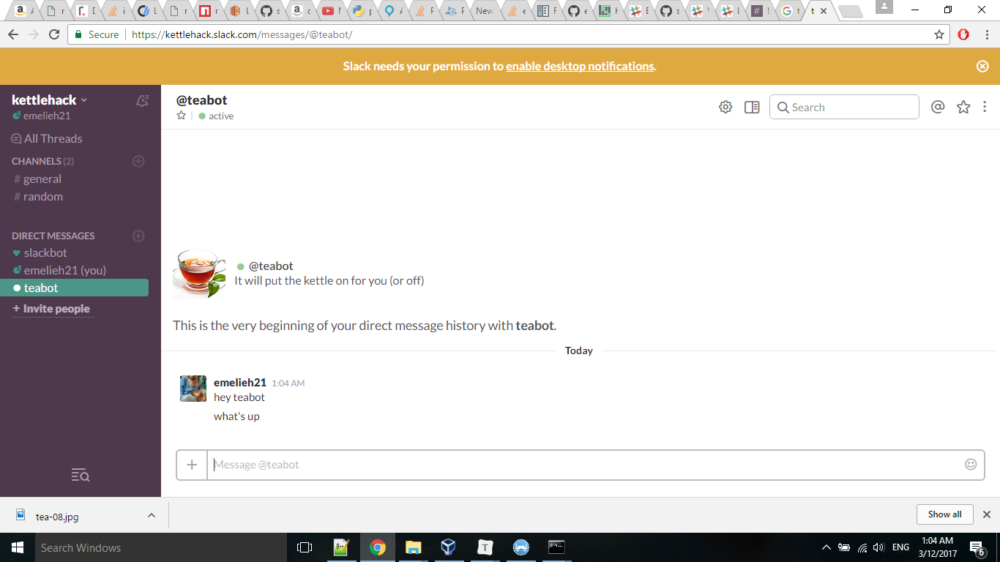

# Triggering the Kettle via a SlackBot

Wouldn't it be nice to be able to chat with your kettle via Slack?

### Step 1: Follow the tutorial

For the setup of the SlackBot, we simply followed this [tutorial](https://www.fullstackpython.com/blog/build-first-slack-bot-python.html). Incredibly clear tutorial, you can have your SlackBot running within 30 minutes. 

The [teabot.py](teabot.py) file runs a very simple SlackBot that you can ask the following things:

_@teabot make tea_

_@teabot stop boiling_

_@teabot is the kettle boiling?_

Make sure you have your devices setup in the cloud - as explained [here](https://github.com/Emelieh21/brand-new-kettle-hack/blob/master/setup_devices_relayr_cloud.md). You will need to fill in your relayr **device ID** and **API token** in the teabot.py file and save it. Run:

`$ python teabot.py`

If you followed the steps in the tutorial above correctly, your SlackBot server will now start running and you will be able to communicate with your bot via Slack. 

### Step 2: Have fun chatting with teabot (or however your bot is called)

Don't forget to start everything you say to your bot with _@your_bot_name_ (as you can see, I did not get this in the beginning).

